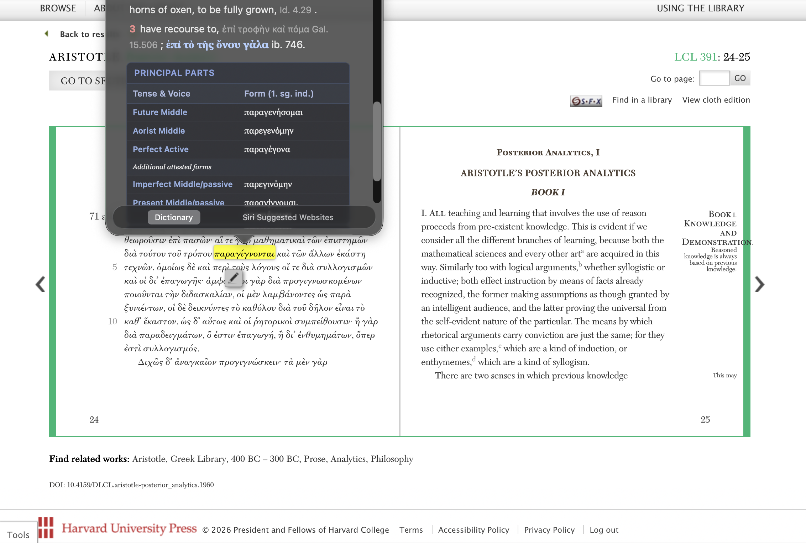
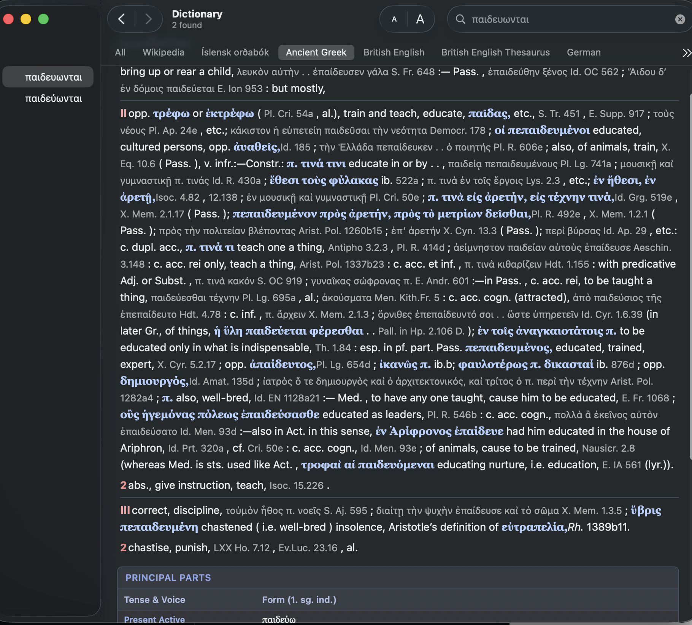

# 🏛️ macOS Ancient Greek Dictionary




A custom `.dictionary` plugin for the native macOS Dictionary app and system-wide "Look Up" feature. This dictionary combines the **complete Liddell–Scott–Jones (LSJ) lexicon** (117,129 unabridged entries) with beautifully styled noun declensions and verb principal parts.

**v1.0.0** — Full unabridged LSJ with comprehensive styling, always-visible morphology tables, and hierarchical sense indentation.

## ✨ Features

* **117k Unabridged LSJ Entries:** Full Chicago TEI-XML LSJ data compiled into the macOS `.dictionary` format.
* **System Integration:** Works natively with macOS "Look Up" (Force Click or Three-Finger Tap on any word).
* **Morphology Tables:** Declensions and principal parts always visible (no folds). Declension tables show all cases and numbers; principal parts organized in classical order (Present → Future → Aorist → Perfect).
* **Hierarchical Sense Indentation:** Major senses (I, II, III…) styled as visual subheadings; sub-senses indented with subtle left borders for visual hierarchy.
* **Polytonic Support:** Handles Greek diacritics and polytonic accents smoothly within Apple's search engine.

## 📦 Installation (For End Users)

1. Download the latest release from the [Releases](https://github.com/Josolon/ancient-greek-mac/releases) page.
2. Unzip the `.zip` file to get `AncientGreek.dictionary`.
3. Open Finder, press `Cmd + Shift + G`, and navigate to `~/Library/Dictionaries/`.
4. Drag and drop the `AncientGreek.dictionary` folder into this location.
5. Open the macOS **Dictionary app**, go to **Settings**, and enable "Ancient Greek (LSJ)".

## 🛠️ Building from Source

### Prerequisites
* Python 3.x
* [Dictionary Development Kit](https://developer.apple.com/download/all/) (Found in Apple's "Additional Tools for Xcode").
* macOS 10.6+ and Xcode command-line tools.

### Build Scripts

This project includes two build pipelines:

#### **`scripts/build_xml.py`** — Quick abridged version (from SQLite databases)
For rapid iteration during development. Generates a smaller dictionary from pre-built morphology SQLite databases.

```bash
python3 scripts/build_xml.py
cd src && make install
```

#### **`scripts/build_unabridged_xml.py`** — Full LSJ (117k entries from TEI-XML)
Compiles the complete unabridged Chicago TEI-XML LSJ corpus. This is the official v1.0.0+ build.

```bash
python3 scripts/build_unabridged_xml.py
cd src && make install
```

### Full Build Instructions

1. Clone this repository:
   ```bash
   git clone https://github.com/Josolon/ancient-greek-mac.git
   cd ancient-greek-mac
   ```

2. Run the XML generation script (choose one):
   - **For development:** `python3 scripts/build_xml.py`
   - **For official build:** `python3 scripts/build_unabridged_xml.py`

3. Compile and install the dictionary:
   ```bash
   cd src
   make install
   ```

4. Open the **Dictionary** app, go to **Settings**, toggle "Ancient Greek" off and back on to reload.

### CSS Styling

All visual presentation is controlled by `src/GreekDictionary.css`. The stylesheet defines:
- Entry heading styling with polytonic support
- Sense hierarchy with depth-based indentation and colored left borders
- Major sense (Roman numeral) subheadings with separator lines
- Morphology table styling (declensions, principal parts)
- Greek text (`gk-word`) and citation (`citation`) highlighting
## 📁 Project Structure

```
ancient-greek-mac/
├── data/
│   ├── lsj_unicode/           # Chicago TEI-XML LSJ source (86 files)
│   ├── lsj.db                 # SQLite LSJ entries [gitignored]
│   └── morph.db               # SQLite morphology data [gitignored]
├── scripts/
│   ├── build_xml.py           # Abridged builder (SQLite → XML)
│   └── build_unabridged_xml.py # Full LSJ builder (TEI-XML → XML)
├── src/
│   ├── GreekDictionary.xml    # Generated dictionary source [gitignored]
│   ├── GreekDictionary.css    # Dictionary styling
│   ├── GreekDictionary.plist  # Apple Dictionary metadata
│   ├── Makefile               # Build rules
│   └── objects/               # Build artifacts [gitignored]
└── README.md
```

## 📚 Data Sources

* **LSJ Lexicon:** Complete Liddell–Scott–Jones ancient Greek dictionary, provided by the [Chicago Digital Classics](https://github.com/perseids-project/morphology) project in TEI-XML format.
* **Morphology:** Ancient Greek inflectional morphology from [Morpheus](https://github.com/perseids-project/morphology), integrated for noun declension and verb principal parts tables.

## 🤝 Contributing

Contributions are welcome! Areas for improvement include:

* **Styling:** Enhance CSS for better typography, colors, or responsive layout.
* **Python scripts:** Optimize parsing, add error handling, or support additional morphology databases.
* **Documentation:** Expand README, add usage guides, or create troubleshooting FAQs.
* **Morphology data:** Map additional inflectional forms or refine existing mappings.

To contribute:
1. Fork this repository.
2. Create a feature branch (`git checkout -b feature/my-improvement`).
3. Commit your changes (`git commit -m "Add feature X"`).
4. Push and open a Pull Request.

## 📄 License

This project uses a **dual-license model**:

- **Code** (Python scripts, CSS, Makefile): [MIT License](LICENSE)
- **Data** (LSJ lexicon, morphology): [Creative Commons Attribution-ShareAlike 4.0 International](https://creativecommons.org/licenses/by-sa/4.0/) (per Chicago Digital Classics)

See [LICENSE](LICENSE) for full details. When distributing this dictionary, both licenses apply.

## 🙏 Acknowledgments

* **Liddell, Scott, Jones (LSJ):** The foundational ancient Greek lexicon.
* **Perseus Digital Library / Perseids:** For TEI-XML source data and morphology tooling.
* **Apple Dictionary Development Kit:** For the macOS `.dictionary` format specification.
