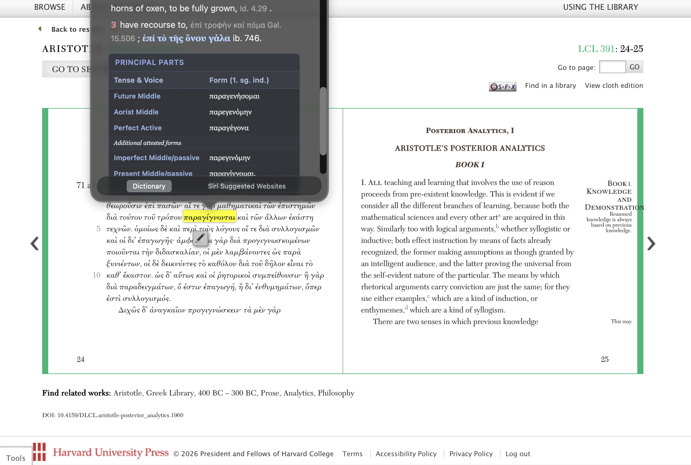
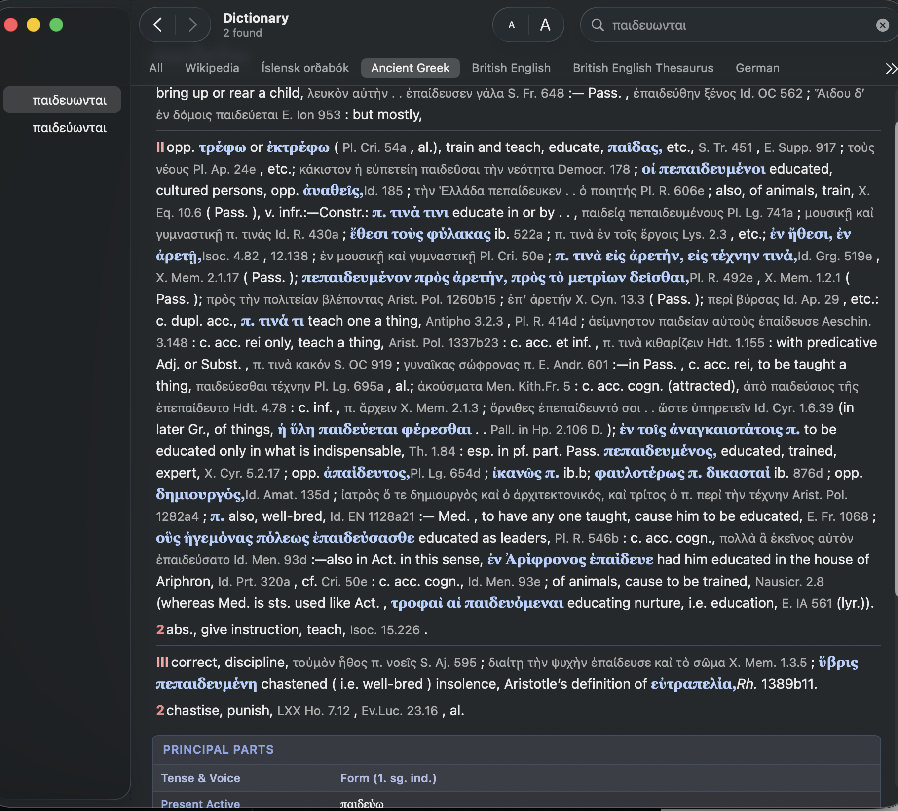

# 🏛️ Ancient Greek Dictionary




A dictionary combining the **complete Liddell–Scott–Jones (LSJ) lexicon** (117,129 unabridged entries) with beautifully styled noun declensions and verb principal parts.

It ships in two forms, from the same source data:

* **macOS** — a `.dictionary` plugin for the native Dictionary app and the system-wide "Look Up" feature.
* **Linux & Windows** — a StarDict build for [GoldenDict-ng](https://xiaoyifang.github.io/goldendict-ng/), whose **Scan Popup** gives the same select-a-word-and-look-it-up workflow. See [docs/GOLDENDICT.md](docs/GOLDENDICT.md).

**v1.5.0** — Linux and Windows support via StarDict/GoldenDict-ng, built from the same XML as the macOS bundles: all 122,312 entries and all 4,406,456 indexed inflected forms, so selecting `ἐποίησεν` in a text resolves to `ποιέω` exactly as it does on macOS. Cross-dictionary grammar links are rewritten from Apple's `x-dictionary:` scheme to `bword:`, and the stylesheet is re-cut for GoldenDict with a dark-mode variant, cross-platform font stacks, and collapsed sense indentation at popup width.

**v1.4.0** — Reconstructed Classical Attic pronunciation (IPA, per W. Sidney Allen's *Vox Graeca*) on every LSJ entry, with a cross-language Pronunciation Guide reference entry (English/German/French/Italian/Spanish/Modern Greek/Icelandic/Latin); vowel length (macron/breve) shown directly on headwords, from three independent sources (LSJ's `orth_orig`, LSJ's `pron` brackets, and Wiktionary's conjugation tables); clickable cross-references between the two dictionaries; and an experimental Wiktionary etymology integration (**work in progress, ~12% coverage** - see Data Sources), shown alongside LSJ's own etymology just above the morphology tables. Also corrects diacritic stacking order (macron under the accent; breathing before accent) and properly credits Helma Dik/Logeion for the LSJ text this is built on.

## ✨ Features

* **117k Unabridged LSJ Entries:** The full LSJLogeion TEI-XML text (Perseus LSJ as edited by Helma Dik/Logeion) compiled into the macOS `.dictionary` format.
* **System Integration:** Works natively with macOS "Look Up" (Force Click or Three-Finger Tap on any word), and with GoldenDict's Scan Popup on Linux and Windows.
* **Cross-platform:** The same data builds to both Apple's `.dictionary` format and StarDict, from one set of scripts. Nothing is macOS-only except the packaging step.
* **Morphology Tables:** Declensions and principal parts always visible (no folds). Declension tables show all cases and numbers; principal parts organized in classical order (Present → Future → Aorist → Perfect).
* **Hierarchical Sense Indentation:** Major senses (I, II, III…) styled as visual subheadings; sub-senses indented with subtle left borders for visual hierarchy.
* **Grammar & Etymology:** Part of speech, gender, declension class, and dialect/voice/comparative/diminutive labels are pulled out of LSJ's own TEI tags into a labeled badge row, both at the entry level and on individual senses (e.g. a sense marked "as Subst." shows a `substantive` badge right there). A bare "Related to: X" etymology line surfaces LSJ's own cross-reference where the source has one, and (where available - see Data Sources) a fuller Wiktionary etymology paragraph is shown alongside it.
* **Reconstructed pronunciation (Vox Graeca):** Every entry shows a reconstructed Classical Attic IPA transcription per W. Sidney Allen's *Vox Graeca* - phonemic vowel length, the "spurious diphthongs" ει/ου, aspirated stops, pitch (not stress) accent modeled per-mora, hiatus-conditioned glide lengthening, and more. A companion "Pronunciation Guide" reference entry (searchable under "pronunciation") maps every vowel/diphthong/consonant/geminate onto real example words in eight other languages. Vowel length for the "dichrona" α/ι/υ (not shown by ordinary spelling) is displayed directly on the headword with a macron/breve wherever LSJ's own source data records it.
* **Grammar & Syntax cross-references:** Particles, conjunctions, and verbs with special constructions (ἄν, γάρ, ὅτι, βούλομαι, τυγχάνω, …) are cross-referenced to the specific paragraphs of Smyth's and Goodwin's reference grammars that discuss them - and clickable, jumping straight into the companion Grammar Reference dictionary (and back again, for its own internal "see 348"-style cross-references).
* **Companion "Greek Grammar Reference" dictionary:** A second `.dictionary` bundle covering ~700 topics from Smyth's *A Greek Grammar for Colleges* and Goodwin's *Syntax of the Moods and Tenses of the Greek Verb*, searchable both by topic ("Genitive Absolute", "Conditional Sentences", …) and by canonical citation (`S. 2070`, `Smyth 2070`, `G. 473`, `Goodwin 473`).
* **Polytonic Support:** Handles Greek diacritics and polytonic accents smoothly within Apple's search engine.

## 📦 Installation (For End Users)

### macOS

1. Download `AncientGreek.dictionary.zip` from the [Releases](https://github.com/Josolon/ancient-greek-mac/releases) page.
2. Unzip the `.zip` file to get `AncientGreek.dictionary` and `GreekGrammarReference.dictionary`.
3. Open Finder, press `Cmd + Shift + G`, and navigate to `~/Library/Dictionaries/`.
4. Drag and drop both `.dictionary` folders into this location.
5. Open the macOS **Dictionary app**, go to **Settings**, and enable "Ancient Greek (LSJ)" and/or "Ancient Greek Grammar (Smyth & Goodwin)".

### Linux & Windows

1. Install [GoldenDict-ng](https://xiaoyifang.github.io/goldendict-ng/) (the maintained fork, not the original GoldenDict).
2. Download `AncientGreek-GoldenDict-<version>.zip` and unzip it somewhere permanent.
3. In GoldenDict: **Edit → Dictionaries → Sources → Files → Add…** and select the unzipped folder.
4. Copy `article-style.css` into GoldenDict's config folder — see [docs/GOLDENDICT.md](docs/GOLDENDICT.md) for the exact path and the non-destructive addon-style method.
5. Enable **Scan Popup** for select-anywhere lookup. On Wayland this needs X11 mode (`QT_QPA_PLATFORM=xcb`); the full explanation is in the same document.

## 🛠️ Building from Source

### Prerequisites
* Python 3.x
* [Dictionary Development Kit](https://developer.apple.com/download/all/) (Found in Apple's "Additional Tools for Xcode").
* macOS 10.6+ and Xcode command-line tools.

### Build Scripts

This project includes two build pipelines:

#### **`scripts/build_xml.py`** — Quick abridged version (from SQLite databases)
For rapid iteration during development. Generates a smaller dictionary from pre-built morphology SQLite databases.

```bash
python3 scripts/build_xml.py
cd src && make install
```

#### **`scripts/build_unabridged_xml.py`** — Full LSJ (117k entries from TEI-XML)
Compiles the complete unabridged LSJLogeion TEI-XML corpus. This is the official v1.0.0+ build.

```bash
python3 scripts/build_unabridged_xml.py
cd src && make install
```

#### **`scripts/build_grammar_reference.py`** — Companion Grammar Reference dictionary
Compiles Smyth's and Goodwin's reference grammars into the second `.dictionary` bundle, and emits `data/grammar_word_index.json` (a Greek word → paragraph-reference index) that `build_unabridged_xml.py` reads to add "Grammar & Syntax" cross-references to LSJ's particle/conjunction entries. Run this *before* `build_unabridged_xml.py` if you want those cross-references included - it's optional; the main dictionary still builds fine without it.

```bash
python3 scripts/fetch_grammar_sources.py   # one-time: vendors Smyth + Goodwin into data/
python3 scripts/build_grammar_reference.py
python3 scripts/build_unabridged_xml.py
cd src && make install
```

#### **`scripts/fetch_wiktionary_data.py`** — Wiktionary etymology + vowel length (optional, work in progress)
Filters a shared, un-versioned Wiktionary Ancient Greek extract (see Data Sources) down to `data/wiktionary_etymology.json` (a fuller etymology paragraph shown alongside LSJ's own bare cross-reference, where Wiktionary has one) and `data/wiktionary_vowel_length.json` (a third, independent source of dichrona α/ι/υ length for headwords LSJ's own data doesn't mark at all - e.g. λύω, θύω "to sacrifice"). `build_unabridged_xml.py` reads both. Entirely optional - the main dictionary builds fine without either, just without that extra data. Run before `build_unabridged_xml.py` if you want them included.

```bash
python3 scripts/fetch_wiktionary_data.py
python3 scripts/build_unabridged_xml.py
cd src && make install
```

#### **`scripts/build_stardict.py`** — StarDict build for Linux/Windows (GoldenDict-ng)
Converts the same generated Apple XML into StarDict (`.ifo`/`.idx`/`.dict`/`.syn`). Streams the ~450 MB `GreekDictionary.xml` rather than loading it, rewrites `x-dictionary:` cross-dictionary links to `bword:`, and emits every `<d:index>` as a StarDict synonym so the full Morpheus morphology stays searchable. `scripts/verify_stardict.py` reads a built set back independently of the writer and checks sort order, offset integrity and UTF-8 validity. `scripts/package_goldendict.sh` runs both plus the stylesheet and docs into a release zip.

```bash
python3 scripts/build_unabridged_xml.py
python3 scripts/build_grammar_reference.py
./scripts/package_goldendict.sh v1.5.0
```

#### **`scripts/dictzip.py`** — the .dz container, in pure Python
StarDict bodies ship as `.dict.dz`: ordinary gzip plus an `RA` subfield in the header listing each chunk's compressed size, so a reader can seek to one article instead of inflating 213 MB. Implemented here rather than shelling out to the `dictzip` binary, which is not separately packaged on macOS (it ships inside dictd) — so the build is reproducible anywhere Python runs. `python3 scripts/dictzip.py` runs a self-test that round-trips several inputs through Python's own `gzip` and confirms every chunk inflates independently, which is the property random access depends on.

### Full Build Instructions

1. Clone this repository:
   ```bash
   git clone https://github.com/Josolon/ancient-greek-mac.git
   cd ancient-greek-mac
   ```

2. (Optional, for grammar cross-references) Fetch and build the grammar reference sources:
   ```bash
   python3 scripts/fetch_grammar_sources.py
   python3 scripts/build_grammar_reference.py
   ```

3. Run the XML generation script (choose one):
   - **For development:** `python3 scripts/build_xml.py`
   - **For official build:** `python3 scripts/build_unabridged_xml.py`

4. Compile and install both dictionaries:
   ```bash
   cd src
   make install
   ```

5. Open the **Dictionary** app, go to **Settings**, toggle "Ancient Greek" and "Ancient Greek Grammar" off and back on to reload.

### CSS Styling

All visual presentation is controlled by `src/GreekDictionary.css`. The stylesheet defines:
- Entry heading styling with polytonic support
- Sense hierarchy with depth-based indentation and colored left borders
- Major sense (Roman numeral) subheadings with separator lines
- Morphology table styling (declensions, principal parts)
- Greek text (`gk-word`) and citation (`citation`) highlighting

For the GoldenDict build, `src/GoldenDictArticle.css` merges the two macOS stylesheets and adapts them: cross-platform font stacks (DejaVu Serif on Linux, Palatino Linotype on Windows — both have real polytonic coverage), a `prefers-color-scheme` dark variant, and collapsed sense indentation below 520px so deep LSJ entries stay readable at Scan Popup width. Everything is scoped to `.agk-article` so it cannot disturb a user's other dictionaries.

## 📁 Project Structure

```
ancient-greek-mac/
├── data/
│   ├── lsj_unicode/           # LSJLogeion TEI-XML source (86 files)
│   ├── lsj.db                 # SQLite LSJ entries [gitignored]
│   ├── morph.db                # SQLite morphology data [gitignored]
│   ├── smyth_html/             # Smyth grammar HTML chapters [gitignored, fetched]
│   ├── goodwin.xml             # Goodwin grammar TEI-XML [gitignored, fetched]
│   ├── grammar_word_index.json # Word → Smyth/Goodwin paragraph index [gitignored, generated]
│   ├── wiktionary_etymology.json # Word → Wiktionary etymology text [gitignored, generated]
│   └── wiktionary_vowel_length.json # Word → Wiktionary canonical (length-marked) form [gitignored, generated]
├── scripts/
│   ├── build_xml.py           # Abridged builder (SQLite → XML)
│   ├── build_unabridged_xml.py # Full LSJ builder (TEI-XML → XML)
│   ├── fetch_grammar_sources.py # Vendors Smyth + Goodwin from Perseus
│   ├── build_grammar_reference.py # Grammar Reference dictionary + word index builder
│   ├── fetch_wiktionary_data.py # Filters the shared Wiktionary extract to the two data/wiktionary_*.json lookups
│   ├── build_stardict.py      # Apple XML → StarDict, for GoldenDict-ng (Linux/Windows)
│   ├── verify_stardict.py     # Independent reader/validator for a built StarDict set
│   ├── package_goldendict.sh  # Builds + verifies + zips the GoldenDict release
│   └── phonology.py           # Reconstructed-Attic IPA transcription engine
├── src/
│   ├── GreekDictionary.xml    # Generated LSJ dictionary source [gitignored]
│   ├── GreekDictionary.css    # LSJ dictionary styling (macOS)
│   ├── GreekDictionary.plist  # LSJ Apple Dictionary metadata
│   ├── GrammarReference.xml   # Generated Grammar Reference source [gitignored]
│   ├── GrammarReference.css   # Grammar Reference styling (macOS)
│   ├── GrammarReference.plist # Grammar Reference Apple Dictionary metadata
│   ├── GoldenDictArticle.css  # Both stylesheets merged + adapted, ships as article-style.css
│   ├── Makefile               # Build rules for both bundles
│   └── objects/               # Build artifacts [gitignored]
├── docs/
│   └── GOLDENDICT.md          # Linux/Windows install, Scan Popup, Wayland caveat
├── dist/                      # StarDict build output + release zip [gitignored]
└── README.md
```

## 📚 Data Sources

* **LSJ Lexicon:** Complete Liddell–Scott–Jones ancient Greek dictionary, from [LSJLogeion](https://github.com/helmadik/LSJLogeion) — the heavily edited Chicago/Logeion version of the Perseus LSJ, with all Greek converted to Unicode, many entries split or merged, and ongoing corrections against the print text and the Supplements. **Please credit both Perseus Tufts and Helma Dik/Logeion**, as that project asks. Editorial work by [Helma Dik](https://github.com/helmadik) and contributors; original TEI-XML from the [Perseus Digital Library](https://www.perseus.tufts.edu/), Tufts University.
* **Morphology:** Ancient Greek inflectional morphology from [Morpheus](https://github.com/perseids-project/morphology), integrated for noun declension and verb principal parts tables.
* **Grammar Reference:** Herbert Weir Smyth, *A Greek Grammar for Colleges* (1920), via [PerseusDL/sg_reader](https://github.com/PerseusDL/sg_reader); William Watson Goodwin, *Syntax of the Moods and Tenses of the Greek Verb* (1889), via the [Perseus Digital Library](https://www.perseus.tufts.edu/). Both public domain, freely redistributable with attribution per Perseus's standard text-reuse policy.
* **Pronunciation:** Reconstructed Classical Attic phonology per W. Sidney Allen, *Vox Graeca* (3rd ed., 1987).
* **Wiktionary Etymology (⚠️ work in progress):** Etymology text from the Ancient Greek (`grc`) entries of [Wiktionary](https://en.wiktionary.org/), via [kaikki.org](https://kaikki.org/)'s raw [Wiktextract](https://github.com/tatuylonen/wiktextract) data dump (CC BY-SA 4.0 / GFDL, per Wiktionary's own licensing). This only covers about **12% of the LSJ dictionary** - most LSJ headwords (rare forms, proper nouns, inflected citation forms) simply have no matching Wiktionary entry yet - and where a headword has more than one Wiktionary sense with a genuinely different etymology, all of them are shown rather than guessed at. Shown alongside, not in place of, LSJ's own etymology cross-reference.

## 🤝 Contributing

Contributions are welcome! Areas for improvement include:

* **Weird/broken entries:** By far the most valuable contribution. With 117,129 entries auto-generated from TEI-XML, edge cases in the source encoding inevitably slip through (missing headings, mangled overview boxes, garbled citations, etc.). If you spot an entry that looks wrong in the Dictionary app, [open an issue](https://github.com/Josolon/ancient-greek-mac/issues) with the headword and a screenshot/description - or better yet, trace it to the parsing logic in `scripts/build_unabridged_xml.py` and send a PR.
* **Styling:** Enhance CSS for better typography, colors, or responsive layout.
* **Python scripts:** Optimize parsing, add error handling, or improve how the TEI-XML hierarchy (senses, headings, preambles) is reconstructed.
* **Documentation:** Expand README, add usage guides, or create troubleshooting FAQs.

**Not in scope here:** morphological data (declensions, principal parts, inflectional forms) comes from the upstream [Morpheus](https://github.com/perseids-project/morphology) database and is maintained by classicists there, not in this repo. If you find an incorrect or missing inflected form, please report it upstream rather than opening a PR against `data/morph.db` here.

To contribute:
1. Fork this repository.
2. Create a feature branch (`git checkout -b feature/my-improvement`).
3. Commit your changes (`git commit -m "Add feature X"`).
4. Push and open a Pull Request.

## 📄 License

This project uses a **dual-license model**:

- **Code** (Python scripts, CSS, Makefile): [MIT License](LICENSE)
- **Data** (LSJ lexicon, morphology): [Creative Commons Attribution-ShareAlike 4.0 International](https://creativecommons.org/licenses/by-sa/4.0/) — attribution to **Perseus Tufts and Helma Dik/Logeion** ([LSJLogeion](https://github.com/helmadik/LSJLogeion)), as that project requests
- **Grammar Reference data** (Smyth, Goodwin): public domain texts, redistributed per the Perseus Digital Library's standard policy - freely distributable with attribution to Perseus, National Endowment for the Humanities funding, and the original authors.
- **Wiktionary etymology data:** CC BY-SA 4.0 / GFDL, per [Wiktionary](https://en.wiktionary.org/)'s own dual licensing.

See [LICENSE](LICENSE) for full details. When distributing this dictionary, all applicable licenses apply.

## 🙏 Acknowledgments

* **Liddell, Scott, Jones (LSJ):** The foundational ancient Greek lexicon.
* **Helma Dik and the Logeion project (University of Chicago):** For [LSJLogeion](https://github.com/helmadik/LSJLogeion) — the years of editorial work behind the text this dictionary is built on: the Unicode conversion, entries split and merged, and continuous corrections against the print edition and its Supplements.
* **Herbert Weir Smyth** and **William Watson Goodwin:** Authors of the reference grammars behind the Grammar Reference dictionary and the Grammar & Syntax cross-references.
* **Perseus Digital Library / Perseids:** For TEI-XML source data, morphology tooling, and the Smyth/Goodwin digitizations (funded in part by the National Endowment for the Humanities).
* **W. Sidney Allen:** *Vox Graeca*, the reconstructed-pronunciation reference this dictionary's IPA transcriptions follow.
* **Wiktionary contributors / kaikki.org / Wiktextract:** For the etymology data (work in progress, see Data Sources).
* **Apple Dictionary Development Kit:** For the macOS `.dictionary` format specification.
